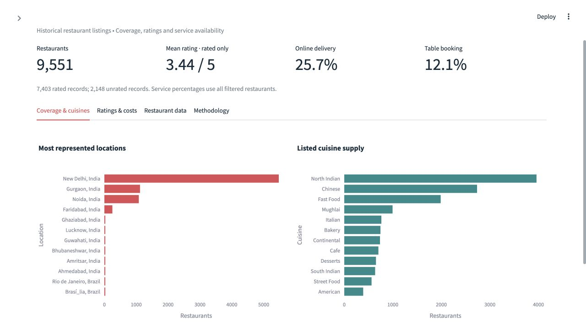
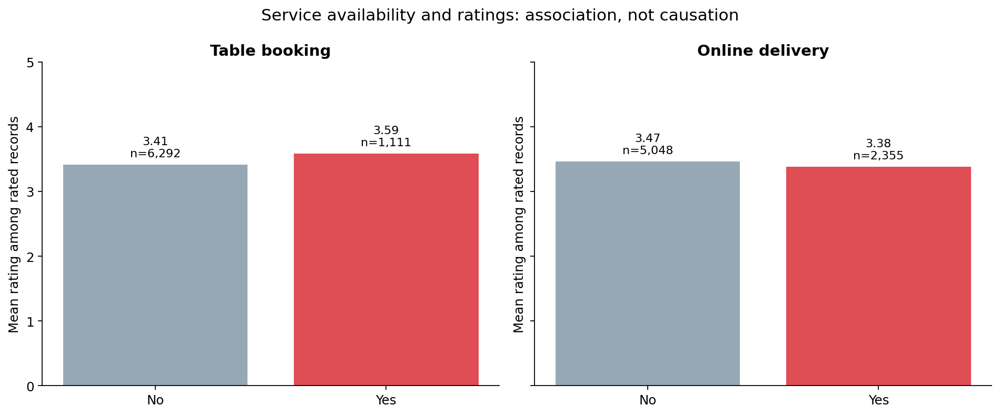

# Zomato Restaurant Analysis

A reproducible data analyst portfolio project exploring restaurant coverage, ratings, cuisine supply, pricing tiers, online delivery and table booking. Built with **Python, pandas, DuckDB SQL, Matplotlib, Plotly and Streamlit**.

## Dashboard preview



The screenshot shows the all-country view. Run the Streamlit app to use the interactive filters and explore other tabs.



## Business questions

1. Where is the dataset concentrated, and how does coverage limit comparisons?
2. How do ratings differ with table booking, online delivery and price tier?
3. Among highly rated restaurants, what percentage offer table booking?
4. Which cuisines appear most frequently, and what are their sample sizes?
5. What is the typical positive cost for two within each country and recorded currency?

<!-- FINDINGS START -->
<!-- Generated by python -m src.pipeline; do not hand-edit metrics. -->
## Computed findings

- **9,551 restaurants** across **15 countries** and **141 country–city pairs**.
- **India accounts for 8,652 restaurants (90.59%)**. This dataset is geographically concentrated.
- **7,403 rated restaurants**; the restaurant-level mean among rated records is **3.44/5**. **2,148 unrated records** are excluded from all mean ratings.
- **1,380 restaurants** have a rating ≥4.0. Of these, **287 (20.80%)** offer table booking.
- **25.66%** of all restaurants offer online delivery; **12.12%** offer table booking.
- **9 missing cuisine records**, **18 zero-cost records**, and **497 zero-coordinate pairs** are flagged rather than invented or silently replaced.

### Interpretation and proposed next steps

Prioritize country and city comparisons over a single global league table because coverage differs sharply. Test booking and delivery hypotheses within the same city and price tier; observed associations cannot establish a service's effect on ratings. Cuisine counts measure listed supply, not customer demand. Validate demand, economics and recent operating status before recommending expansion.

Costs are reported only within country and recorded currency, excluding zero costs. The source has suspicious currency labels (for example Philippine records labelled Botswana Pula); no exchange-rate conversion or undocumented correction is applied. Price range is an ordinal source category, not a common monetary scale.

<!-- FINDINGS END -->

## Run locally

Use Python **3.11–3.13** (verified here with Python 3.13 on macOS). From this folder:

```bash
python3 -m venv .venv
source .venv/bin/activate
python -m pip install -r requirements.txt
python -m src.pipeline
python -m pytest -q
python -m streamlit run app.py
```

Open the local URL printed by Streamlit, normally http://localhost:8501. On Windows use `py -m venv .venv` and `.venv\Scripts\activate` instead. Internet is needed for dependency installation only; the analysis and dashboard use the included local data.

The ZIP includes generated tables, figures, cleaned CSVs and DuckDB database so the results can also be reviewed immediately. `python -m src.pipeline` recreates them from the unchanged raw inputs and updates the findings above. Reruns overwrite generated outputs, not raw files.

### Interactive dashboard

Filter by country, city, price tier, delivery, booking, rated status and minimum votes. Explore coverage and cuisines, compare ratings, inspect currency-specific costs and download filtered records. Empty selections and groups without ratings are handled explicitly.

### Notebooks

Three executed notebooks document cleaning, SQL and EDA. Core logic lives in `src/` to prevent duplicated transformations. Open with Jupyter or VS Code; to execute all notebooks again without a notebook UI:

```bash
python scripts/execute_notebooks.py
```

### Run SQL directly

```python
import duckdb
con = duckdb.connect('data/processed/zomato.duckdb', read_only=True)
print(con.sql("SELECT country, COUNT(*) AS restaurants FROM restaurants GROUP BY country ORDER BY restaurants DESC").df())
con.close()
```

The full executable query collection is in `sql/zomato_analysis.sql`; each named query also produces a CSV in `reports/tables/`. SQL demonstrates conditional aggregation, percentages, joins, CTEs, window functions, `HAVING`, medians and stratified comparisons.

## Repository layout

```text
app.py                      Streamlit dashboard
src/pipeline.py             Validation, cleaning, DuckDB build and report generation
src/visualize.py            Six reproducible EDA figures
sql/zomato_analysis.sql     Ten documented business queries
notebooks/                 Executed cleaning, SQL and EDA notebooks
data/raw/                  Original CSV and country lookup
data/processed/            Cleaned CSV, cuisine bridge and DuckDB database
reports/                   Computed findings, audit, verification and data dictionary
reports/tables/             Machine-readable SQL results
reports/figures/            Charts for GitHub and presentations
tests/                     Data, SQL and dashboard tests
scripts/execute_notebooks.py
requirements.txt           Pinned direct dependencies
requirements-lock.txt      Full environment used for verification (macOS/Python 3.13)
```

## Cleaning and metric definitions

- Read the original CSV as Latin-1 and export UTF-8. Some names already contain text artefacts; encoding conversion does not reconstruct lost characters. Original text is preserved apart from surrounding whitespace.
- Normalize column names, trim text and standardize yes/no values. Fail on unknown booleans, invalid ranges, missing numeric values, duplicate country mappings and conflicting restaurant IDs.
- Remove exact duplicate rows; do not merge distinct restaurant locations or same-name chains. The supplied snapshot has no duplicate IDs.
- Join the supplied country lookup with a many-to-one validation. Correct its `Phillipines` spelling to `Philippines`.
- Preserve all original 21 columns, including the constant `switch_to_order_menu`, and append country and analytical flags. Keep original rating values; derive `rating_for_analysis` as null when zero or “Not rated”.
- Keep nine missing cuisines as missing; exclude them from cuisine-only calculations. Split comma-delimited cuisines into a unique restaurant–cuisine bridge. Cuisine totals overlap.
- Mean ratings weight each rated restaurant equally. Service adoption denominators include all selected restaurants. Highly rated means `rating_for_analysis >= 4.0`; booking among highly rated uses only that population as its denominator.
- Cost summaries exclude zeros and group by both country and recorded currency. Do not interpret ordinal price tiers as equivalent purchasing power across countries.
- Preserve outliers and zero coordinate pairs; flag coordinates unsuitable for mapping. No arbitrary trimming or statistical imputation.

See [data dictionary](reports/data_dictionary.md), [quality audit](reports/data_quality.json), [verification record](reports/verification.md) and [computed findings](reports/findings.md).

## Source and limitations

Inputs were recovered from the user's existing `01-zomato-restaurant-analysis/data/raw` project. The earlier ChatGPT ZIP was not available in this workspace. This project was rebuilt using the actual local raw files; it does not depend on the previous cleaned CSV or database. Raw input SHA-256 hashes are recorded in the quality audit.

The supplied files contain no verified original download URL, collection date, sampling method or dataset license. No URL, date or ownership claim has been invented. Dataset redistribution rights are unverified; no new license is asserted over third-party data. Check the original data provider's terms before publishing the included data publicly. No public upload or deployment has been performed.

This is a historical, geographically uneven sample. Ratings and votes can reflect selection bias and different review volumes. Votes are not revenue, visits or demand. Currency labels have apparent errors, zero costs may represent missing information, and some strings contain encoding artefacts. No causal effects, market-size estimates, current restaurant recommendations or time trends can be inferred from this snapshot.

## Publish to GitHub

After confirming dataset sharing terms, create a repository and upload this folder's contents (README.md at repository root). Exclude `.venv`, caches and secrets. Generated files are intentionally included for recruiter review. For Streamlit hosting, use `app.py` as the entry point and `requirements.txt` for dependencies.

This project demonstrates data validation, reproducible transformations, relational modelling, business SQL, EDA, interactive reporting and automated testing. Findings are computed from the included data rather than copied from the conversation.
