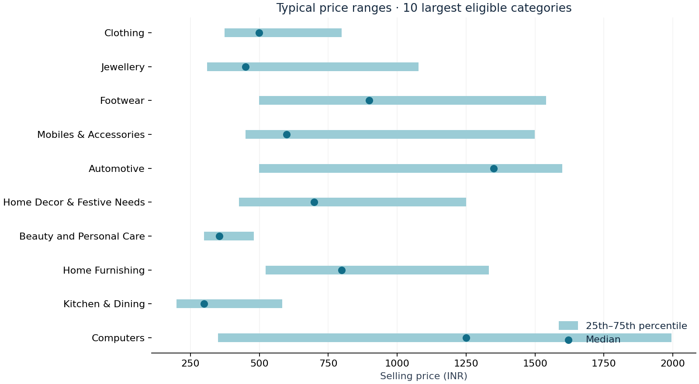

# Flipkart Product Price Analysis

A reproducible EDA portfolio project exploring **20,000 real Flipkart listings**: category pricing, discount patterns, brand representation, percentiles, and unusual prices. Built with **Python, pandas, DuckDB SQL, Matplotlib and Streamlit**.

## Dashboard preview


Run the Streamlit app to use category and brand filters, search products, set a price range, and explore the review queue.



## Business questions

1. Which categories have the deepest listed discounts?
2. What are the P25, median, P75 and P90 prices within each category?
3. Which brands have the greatest listing volume?
4. Where does each product sit within its category's price distribution?
5. Which prices warrant manual review against category IQR fences?
6. How much usable rating data exists, and what can it support?

<!-- FINDINGS START -->
## Computed findings

- Clothing accounts for 31.0% of retained listings.
- Sunglasses has the highest mean discount among categories with at least 30 valid discounts: 60.6%.
- 1,849 listings (9.2%) have a valid numeric rating. Rating results describe this subset only.
- 1,919 listings exceed the category IQR fences. These are candidates for manual review, not confirmed pricing errors.
- Brand is missing for 5,861 listings (29.3%). Brand rankings are incomplete.

<!-- FINDINGS END -->

## Run locally

Use **Python 3.11–3.13**. From this project folder:

```bash
python3 -m venv .venv
source .venv/bin/activate
python -m pip install -r requirements.txt
python -m src.pipeline
python -m unittest discover -s tests -v
python -m streamlit run app.py
```

Open the URL printed by Streamlit, normally **http://localhost:8501**. Keep the terminal running; press Ctrl+C to stop.

On Windows, create the environment with `py -m venv .venv` and activate it with `.venv\Scripts\activate` in Command Prompt or `.venv\Scripts\Activate.ps1` in PowerShell. If activation is blocked, use `.venv\Scripts\python.exe` in place of `python`.

The ZIP includes the original CSV, processed listing snapshot, DuckDB database, charts and computed tables. **No dataset download is required.** Internet is needed only to install dependencies. You can skip rebuilding the pipeline and start Streamlit immediately after installation. The pipeline recreates generated outputs from the included raw data and updates the findings above.

If port 8501 is busy, run `python -m streamlit run app.py --server.port 8502` and open the printed URL.

### Interactive dashboard

- Filter by category and brand, search product names, and optionally apply a selling-price range.
- Compare category listing counts, average discounts, price percentiles and brand representation.
- Review high/low price flags and download the queue or filtered listings as CSV.
- Read metric definitions in the Methodology tab. Empty results are handled explicitly.

The app recalculates descriptive metrics for the filtered selection. Outlier fences stay anchored to the full dataset; filters narrow the review queue without redefining its flags.

### Notebooks

Three executed notebooks document cleaning, SQL analysis and EDA findings. Open them in VS Code or Jupyter, or execute their plain-Python cells with the included runner:

```bash
python scripts/execute_notebooks.py
```

Run the pipeline first. The runner saves actual text outputs into each notebook and does not require Jupyter. Core transformations live in `src/` and `sql/`.

### Run SQL directly

```python
import duckdb
with duckdb.connect('data/processed/flipkart.duckdb', read_only=True) as con:
    print(con.sql('''
        SELECT category, quantile_cont(selling_price, 0.5) AS median_price
        FROM products WHERE valid_price GROUP BY category
        ORDER BY median_price DESC
    ''').df())
```

The eight numbered scripts in `sql/` cover cleaning, quality, category percentiles, brand ranks, price positions, IQR screening, discount bands and sparse ratings. They demonstrate CTEs, conditional aggregation, `ROW_NUMBER`, `DENSE_RANK`, `PERCENT_RANK`, `NTILE`, and continuous percentiles. These scripts use the DuckDB SQL dialect.

## Repository layout

```text
app.py                         Streamlit dashboard
src/pipeline.py                Cleaning, DuckDB build, tables and findings
src/visualize.py               Reproducible EDA charts
src/download.py                Optional source re-download
sql/                           Eight documented SQL steps
notebooks/                     Three executed cleaning, SQL and EDA notebooks
data/raw/                      Original Flipkart CSV
data/processed/                Cleaned CSV snapshot and DuckDB database
reports/findings.md            Computed insights and next steps
reports/data_dictionary.md     Fields, cleaning rules and metric definitions
reports/data_quality.json      Computed quality audit
reports/provenance.json        Source attribution and raw-file SHA-256
reports/verification.md        Verification record
reports/tables/                Seven SQL result tables
reports/figures/               EDA charts and dashboard screenshot
tests/                         SQL and Streamlit tests
scripts/execute_notebooks.py   Re-execute notebook cells
requirements.txt               Pinned direct dependencies
```

## Cleaning and metric definitions

- Preserve raw text in `raw_products`. Deduplicate nonblank `uniq_id` using the latest crawl, keeping blank IDs distinct. The supplied sample has no duplicate IDs.
- Extract the first JSON category path's top-level label. The 265 source labels include small/noisy groups; no speculative merging is performed.
- Price statistics use positive finite selling prices. Discounts also require positive finite retail prices and selling price ≤ retail price.
- Discount = `100 × (retail − selling) / retail`. Each listing gets equal weight. Invalid pairs receive NULL rather than zero.
- Preserve missing brands as Unknown and include them in listing-share denominators.
- Use numeric product ratings from 1 to 5; other values become NULL. Rating coverage is shown explicitly. Correlations require 30 valid price/rating pairs.
- Flag prices outside Q1 − 1.5 × IQR and Q3 + 1.5 × IQR only in known categories with at least 30 valid prices and positive IQR. Preserve flagged rows in the other analyses.

## Interpretation and limitations

The crawl covers **December 2015–June 2016**. These are historical observations, not current Flipkart prices. Listing volume measures representation, not sales or market share. Discounts are not profit margins. Costs, transactions, stock and longitudinal data are required for profitability or demand analysis.

Ratings cover only about 9.2% of listings and can be affected by selection bias. Categories can mix product types, bundles and variants, so IQR flags are candidates for manual review rather than proven errors. Compare like-for-like products before proposing price changes.

## Tests and reproducibility

Seven tests cover price/rating validity, timestamp parsing, duplicate handling, blank IDs, interpolated percentiles, tied ranks, zero-IQR categories, outlier flags, share reconciliation, dashboard filters and empty results. SQL tests use separate synthetic fixtures; dashboard tests use the real included snapshot. GitHub Actions runs the tests on pushes and pull requests.

Source fingerprints, quality totals and generated results make the run auditable. Reruns overwrite processed data and reports while preserving raw inputs. Dashboard screenshots are static captures; replace `reports/figures/dashboard.png` after a visual redesign.

## Add to your EDA GitHub repository

Extract this folder beside your Zomato project:

```text
exploratory-data-analysis-projects/
├── 01-zomato-restaurant-analysis/
└── 02-flipkart-product-price-analysis/
```

Upload the extracted folder contents, including data, reports and screenshots. Exclude `.venv` and caches through the included `.gitignore`. For Streamlit hosting from the parent repository, select `02-flipkart-product-price-analysis/app.py` as the entry point.

Use Git from the parent repository to include the larger raw CSV and database, rather than dragging individual files into the browser:

```bash
git add 02-flipkart-product-price-analysis
git commit -m "Add Flipkart pricing EDA and Streamlit dashboard"
git push
```

## Source and license

Dataset: [PromptCloudHQ / Flipkart Products on Kaggle](https://www.kaggle.com/datasets/PromptCloudHQ/flipkart-products), 20,000 rows and 15 source columns. The source CSV is included unchanged; the optional downloader can retrieve it again.

Kaggle identifies the dataset as **CC BY-SA 4.0**. Preserve [DATA_LICENSE.md](DATA_LICENSE.md) for the original data and derived outputs. Original project code uses the [MIT license](LICENSE). No affiliation or endorsement by Flipkart or PromptCloud is implied.
