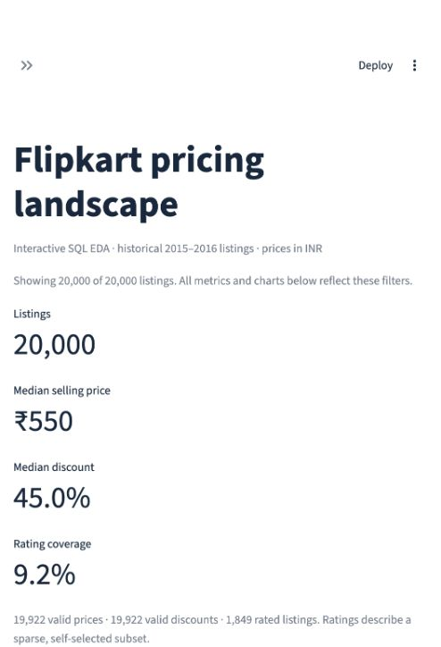

# Exploratory Data Analysis Projects

A portfolio of end-to-end data analysis projects using **Python, SQL and Streamlit** to turn raw datasets into clear business findings.

Each project follows a reproducible workflow: inspect the source data, document quality issues, clean and model the data, answer business questions with SQL, visualize the results, and build an interactive dashboard. Findings include their limitations so that patterns are not mistaken for causal relationships or business outcomes the data cannot measure.

## Projects at a glance

| Project | Business focus | Analysis highlights | Explore |
|---|---|---|---|
| **01 · Zomato Restaurant Analysis** | Restaurant coverage, pricing, ratings and service availability | Geographic concentration, cuisine supply, country-specific costs, online delivery and table booking comparisons | [Project README](01-zomato-restaurant-analysis/README.md) · [Notebooks](01-zomato-restaurant-analysis/notebooks/) · [SQL](01-zomato-restaurant-analysis/sql/) |
| **02 · Flipkart Product Price Analysis** | Product pricing, discounts and brand representation | Category percentiles, listing-volume rankings, discount patterns and IQR price-outlier screening | [Project README](02-flipkart-product-price-analysis/README.md) · [Notebooks](02-flipkart-product-price-analysis/notebooks/) · [SQL](02-flipkart-product-price-analysis/sql/) |

## 01 · Zomato Restaurant Analysis

An analysis of **9,551 restaurant listings** across **15 countries**, examining where the dataset is concentrated and how ratings, pricing and services vary across locations.

**What I investigated**

- Restaurant and cuisine coverage across countries and cities.
- Ratings in relation to online delivery, table booking and price tier.
- Positive cost for two within each country and its recorded currency.
- Missing values, unrated restaurants, zero costs and questionable geographic or currency labels.

**Selected findings**

- India accounts for **90.59%** of listings, limiting the usefulness of a single global comparison.
- **7,403 restaurants** have ratings; unrated records are excluded from average-rating calculations.
- **25.66%** of listed restaurants offer online delivery and **12.12%** offer table booking.

Cuisine counts describe listed supply, not customer demand. Costs are compared within country and recorded currency rather than combined into a misleading global average.


[Read the project](01-zomato-restaurant-analysis/README.md) · [View findings](01-zomato-restaurant-analysis/reports/findings.md) · [View dashboard code](01-zomato-restaurant-analysis/app.py)

## 02 · Flipkart Product Price Analysis

A SQL-focused analysis of **20,000 historical product listings**, exploring category price distributions, listed discounts, brand representation and prices that warrant manual review.

**What I investigated**

- Category price percentiles: P25, median, P75 and P90.
- Average discounts and the distribution of discount bands.
- Brand listing volumes and shares within categories.
- Product price positions using window functions.
- IQR outlier flags and the limitations of sparse product ratings.

**Selected findings**

- **19,922 listings** have usable selling prices; the median is **₹550**.
- The median valid listed discount is **45.0%**.
- Only **1,849 listings (9.245%)** have a valid numeric product rating.
- **1,919 listings** are flagged for review using category IQR fences; these are not confirmed pricing errors.

The dataset covers December 2015–June 2016. Listing volume is not sales volume, and listed discounts do not measure profit margins.



[Read the project](02-flipkart-product-price-analysis/README.md) · [View findings](02-flipkart-product-price-analysis/reports/findings.md) · [View dashboard code](02-flipkart-product-price-analysis/app.py)

## Skills demonstrated

| Area | Work included |
|---|---|
| **Data preparation** | Data profiling, missing-value treatment, type conversion, duplicate handling and analytical flags |
| **SQL analysis** | Joins, CTEs, conditional aggregation, percentages, medians, percentiles and window functions |
| **Exploratory analysis** | Distributions, group comparisons, coverage checks, outlier screening and interpretation |
| **Visualization** | Reproducible charts and interactive Streamlit dashboards |
| **Reproducibility** | Shared analysis code, executed notebooks, local data, pinned dependencies and automated tests |
| **Business communication** | Documented questions, findings, proposed next steps and explicit limitations |

## Repository structure

```text
exploratory-data-analysis-projects/
├── README.md
├── .gitignore
├── 01-zomato-restaurant-analysis/
│   ├── README.md
│   ├── app.py
│   ├── data/
│   ├── notebooks/
│   ├── reports/
│   ├── scripts/
│   ├── sql/
│   ├── src/
│   ├── tests/
│   └── requirements.txt
└── 02-flipkart-product-price-analysis/
    ├── README.md
    ├── app.py
    ├── data/
    ├── notebooks/
    ├── reports/
    ├── scripts/
    ├── sql/
    ├── src/
    ├── tests/
    └── requirements.txt
```

Each project is self-contained. Its README explains its dataset, transformations, metric definitions, dashboard and validation checks.

## Run a project locally

Use **Python 3.11–3.13**. Open a terminal in the repository root and choose one project:

```bash
cd 01-zomato-restaurant-analysis
```

Or:

```bash
cd 02-flipkart-product-price-analysis
```

Create a **separate virtual environment inside each project** because their dependency versions differ.

### macOS / Linux

```bash
python3 -m venv .venv
source .venv/bin/activate
python -m pip install -r requirements.txt
python -m streamlit run app.py
```

### Windows PowerShell

```powershell
py -m venv .venv
.venv\Scripts\Activate.ps1
python -m pip install -r requirements.txt
python -m streamlit run app.py
```

If PowerShell blocks activation, use `.venv\Scripts\python.exe` in place of `python` for installation and launch commands.

Open the URL printed in the terminal, normally **http://localhost:8501**. Keep the terminal running while using the dashboard; press **Ctrl+C** to stop it. If the port is busy, add `--server.port 8502` to the launch command.

The supplied project packages include local data and generated results. Internet access is needed to install dependencies, but the analysis does not require a database server or external API. GitHub displays the documentation and screenshots; to interact with a dashboard, run its Streamlit app locally.

### Rebuild the analysis

From the selected project folder:

```bash
python -m src.pipeline
python scripts/execute_notebooks.py
```

The pipeline regenerates processed data, SQL result tables, figures and findings from the raw inputs. Run the pipeline before re-executing the notebooks.

### Run tests

For Zomato, from its project folder:

```bash
python -m pytest -q
```

For Flipkart, from its project folder:

```bash
python -m unittest discover -s tests -v
```

When switching projects, run `deactivate`, move into the other project folder, and activate that project's environment.

## How to review this portfolio

1. Read a project's **README** for its business questions, findings and limitations.
2. Explore **notebooks/** for the documented analysis and saved outputs.
3. Review **sql/** and **src/** for the reproducible implementation.
4. Inspect **reports/** for charts, query results and data-quality documentation.
5. Run **app.py** with Streamlit to explore the data interactively.

## Data sources and responsible interpretation

Sources, provenance and licensing are documented within each project. Flipkart uses the PromptCloud dataset and includes its CC BY-SA 4.0 attribution. Zomato's README records the limitations of the available source provenance and redistribution information. No blanket license is asserted over all datasets in this repository.

These projects are exploratory analyses of historical samples. Observed associations do not establish causation, listing counts do not measure demand or revenue, and findings should be validated with additional data before making operational decisions.
